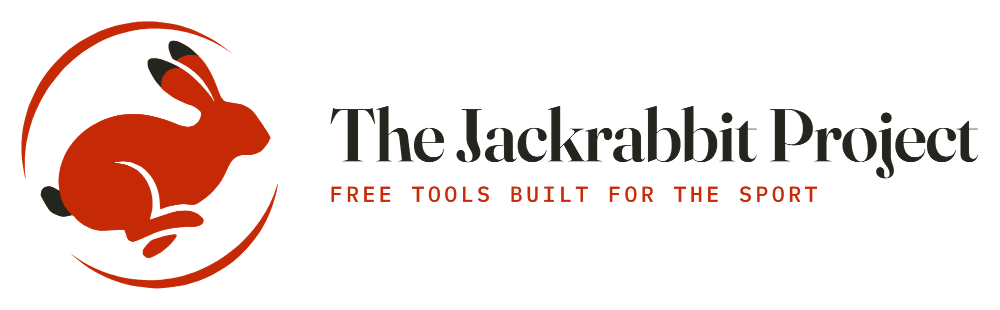

  
  <h1>The Jackrabbit Project</h1>

Creating practical, open tools for the sighthound community.

Focused on modernizing event management, online entries, and club resources while keeping solutions simple, reliable, and accessible.

## Featured Projects

🐾 **[Lure Coursing resources - DEMO site](https://stage.lurecoursing.club/)**

🏆 **[ASFA International Invitational 2026 — DEMO site](https://asfaii2026.lurecoursing.club)**

📖 **[ASFA II — Unofficial Guide](https://ii2026.gazehound.io/)**

📝 **[Lure coursing trial entries](https://entries.lurecoursing.club)**

🏁 **[AOK9 Racing](https://aok9.pages.dev)** *(или [gazehound.io](https://gazehound.io))*

---
*Free, open tools for the sighthound community. The Jackrabbit Project.*
