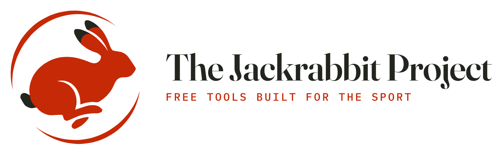

  <picture>
    <source media="(prefers-color-scheme: dark)" srcset="assets/logo-dark.svg">
    
  </picture>

We build web tools for lure coursing and sprint racing — entry forms, event sites, scoring apps
and plain-language guides — for the people who run trials and the people who enter them.
Everything is free, works on a phone, and needs no account.

## Tools you can use today

📊 **[Gazehound Stats](https://stats.gazehound.io)** — Lure coursing and racing stats for ASFA,
LGRA and AOK9, hound by hound. One search box finds a hound in any of the three programs.
*ASFA lure coursing:* the 2026 Top 20 season, searchable — rank, points, movement since the last
update, a shareable stat card, true percentile standings within each breed, BIF and BOB
leaderboards, kennel and region tables, every title earned this season, an event finder with
premium lists linked, the Bowen calculator and the Running Rules (rev. 08/01/2026) on the site.
*LGRA straight racing and AOK9 sprint racing:* standings by breed and all-breed on this season's
National points, career points, WAVE and grade, kennels, and a page for every hound with its last
three meets and its progress toward GRC and SGRC (LGRA) or BRC, MRC and the Supreme titles
(AOK9) — built from the bodies' published grading guides. Every figure traces to a published
page or guide, the arithmetic is re-derived and checked before anything ships, and the site
refreshes weekly.

🏁 **[AOK9 Race Secretary](https://aok9rms.gazehound.io)** — Run a sprint racing meet start to
finish: entries, divisions, programs, results and the official NRD report, following the AOK9
Sprint Racing Rule Book v3.0. Install it once and it runs with no signal at all — meets happen in
fields — and your meet is saved after every change, so closing the laptop loses nothing. **New:
live results online.** Publish the meet and every printed sheet carries a QR code; anyone at the
meet scans it once and follows the divisions, each program's draw, results as they are saved and
the final standings from their phone, with only what the paddock board shows — never owners,
registration numbers or WAVEs. Scoring stays in your own browser: no account, nothing uploaded
unless you choose to publish.

📝 **[Lure Coursing Trial Entries](https://entries.lurecoursing.club)** — An online ASFA trial
entry form. Entrants fill it in, sign and pay; the trial secretary gets a clean, legible entry
instead of a stack of handwriting. **We'll set up and configure a form for your club** — your
stakes and fees, confirmation auto-responders for entrants, entry notifications to your FTS —
just ask.

📖 **[ASFA II 2026 — Unofficial Guide](https://ii2026.gazehound.io/)** — Stakes, fees, deadlines,
awards and travel for the 48th ASFA International Invitational, in plain language on any device.
An unofficial community guide; the official premium list at asfa.org governs. Entries close
September 25, 2026.

## Demos & proposals

Design concepts built to show what a modern site could look like. They're kept online as archives —
nothing on them is live, and no entries or official business run through them.

🐾 **[Lure Coursing Resources](https://demo.lurecoursing.club/)** — A full redesign proposal for a
national lure coursing association site: rulebook, judges and club directories, standings, results,
points and forms, mobile-friendly and built with accessibility in mind.

🏆 **[ASFA International Invitational 2026](https://asfaii2026.lurecoursing.club)** — A concept
event portal for a national specialty: schedule, stakes, fees, trophies and travel in one place.

## Source code

The tools above are built in the open where they can be:

- [`stats`](https://github.com/jackrabbit-project/stats) — everything behind Gazehound Stats:
  the site plus the Python pipeline that reads ASFA's published pages and the LGRA and AOK9
  grading guides, archives them, and verifies every figure before it ships.
- [`aok9`](https://github.com/jackrabbit-project/aok9) — the AOK9 Race Secretary app.
- [`ii2026guide`](https://github.com/jackrabbit-project/ii2026guide) — the ASFA II 2026 guide site.

All are MIT licensed; see each repository's LICENSE for data and asset carve-outs. The entry-form
service and the design demos remain private.

## Get involved

This work exists because people at trials said what was broken. You don't need to write code to help:

- **Tell us what's wrong.** A stale date, a wrong fee, a form that doesn't match how your club
  works — email <info@gazehound.io> or open an issue on that project's repository.
- **Test something before your next trial.** Run a mock meet through the race secretary app, or put
  a real entry through the entry form, and tell us where it fought you.
- **Share your own tool.** Built a spreadsheet, a scoring sheet or a script that saves your club
  time? We'd rather link to it than rebuild it.
- **Contribute code.** Issues and pull requests are welcome on any of the repositories
  under [Source code](#source-code) above.

## About

These projects are built independently, by volunteers, and offered free. They are not published or
endorsed by any club or association. Where a project summarizes official rules, premiums or forms,
the official materials always govern.

---
*The Jackrabbit Project — free tools built for the sport.*
